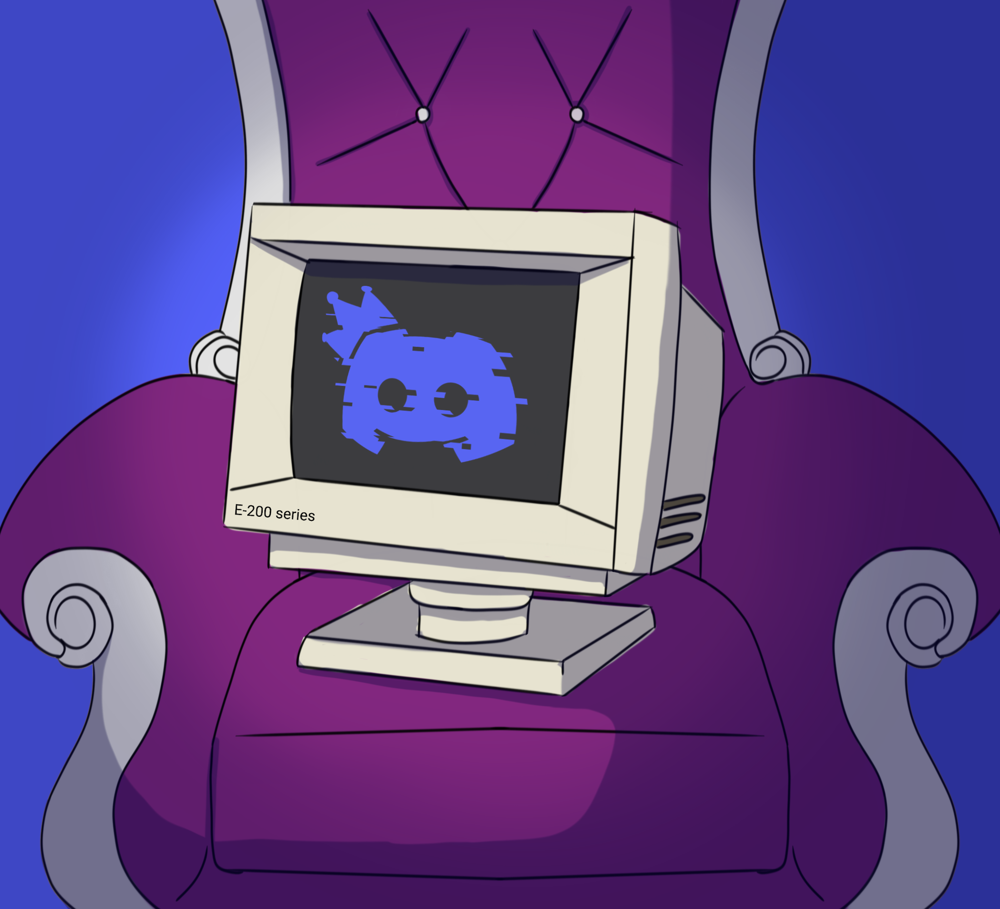

# monarch_bot

[Image by Alien Squid Boi](https://www.instagram.com/alien.squid.boi/)

## Description
Can't agree on who should be the server owner? How about everyone -- but at different times?

This project will rotate the crown around all the members of a brand new server, giving you the opportunity to change your friends' nicknames, make silly rules, or restructure the entire server to your every whim; whatever you want -- as long as it's your turn!

## How to build:
1) `cargo build --bin setup --release`
2) `cargo build --bin switch_monarch --release`
3) ???
4) profit

## How to run:
1) go to the Discord developer portal, make an application, make a bot, and then keep that token handy
2) run setup from your terminal, and then switch_monarch as needed (i have systemd run it once a day, since i use arch btw, but Cron or Task Scheduler should work just as well)